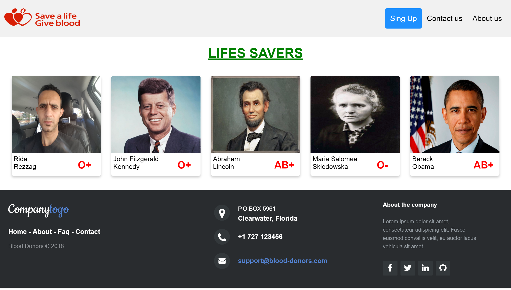
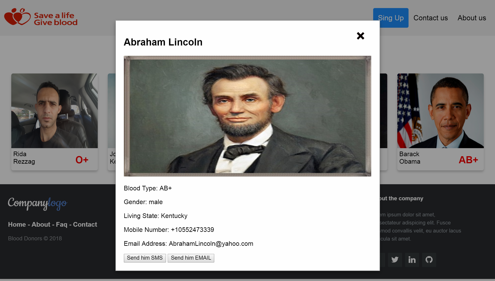
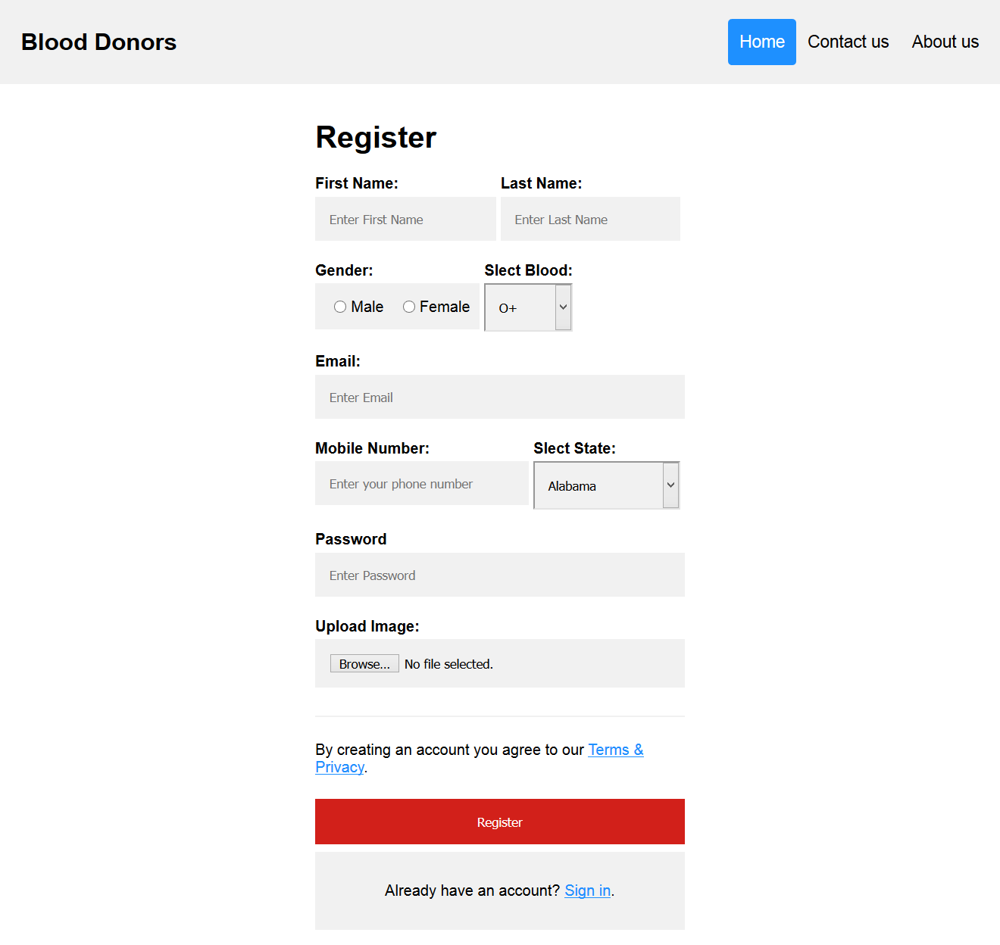
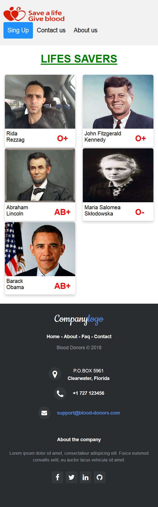
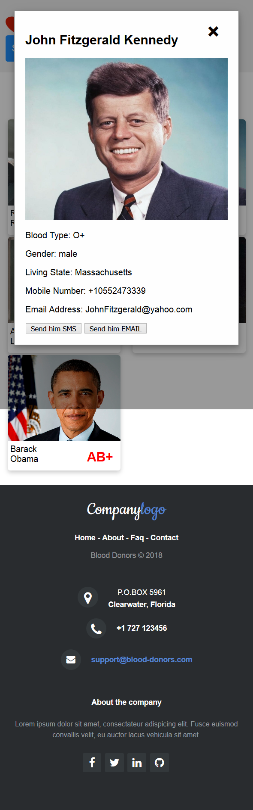
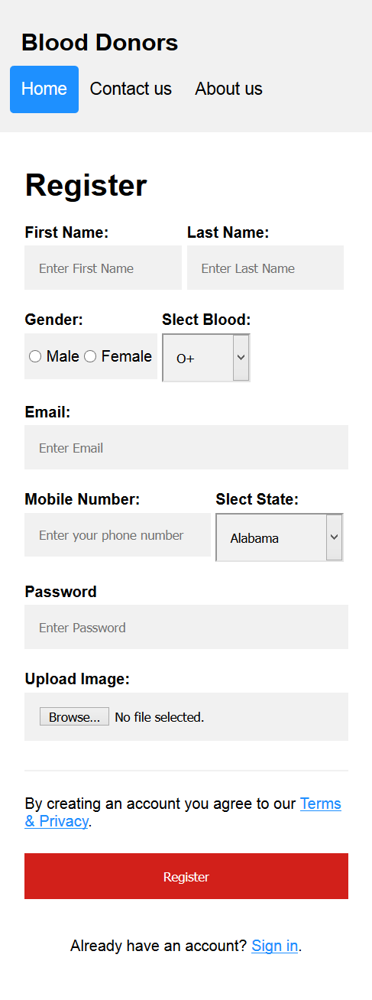

# Blood Donors List

A simple app to list blood donors.

## What is Blood Donors List
This is a simple app built to list blood donors, Members (Donors) list them selves in the app, so they can be available for contact, from whoever is looking for a blood donor, Hospitals or indeveduals who are in need for blood donors, they can use the app to search and contact donors around their geographic location.

## live test at:
   * http://allmofid.com/blood/index.html

## Instructions
* Click on a Donor to see his information
* You can send him/here a SMS or EMAIL.
* Only approved accounts can contact donors.

## How I built the Blood Donors app
Blood donors app is built using JavaScript and Node.js saving data using Mysql databse
Technologies used:
## * Frontend 
* HTML5
* CSS3
* JavaScript

## * Backend 
* Mysql for saving data
* Node.js for RESTful API
   some frameworks used in Node.js 
   * express.js
   * body-parser.js
   * mysql.js
   * express-fileupload.js

# Is the app Responsive? 
  Yes the App is 100% responsive for desktops, tablets, phones.

## How to install the Blood Donors app
first download the repo to your machine.
## * steps: 
* create a Mysql databse in your server name the databse: donors , if you want to test the app in locall machine use Xamp, .
* importe the provided databese copy in this repo from file (Databes copy), to your databse.
* you will see that your databse have a table named members and has few registred members.
* now upload the repos files to your server, or your local server.
* open file api/registre.js and update database info with your newly created database info, databse user and database passweord.
* if node.js already installed in your server make sure to instal:
   * express.js
   * body-parser.js
   * mysql.js
   * express-fileupload.js 
    
* now run the app: node api/registre.js
* open index.html in your browser

## Desktop ScreenShot Examples

## * registre form

## Mobile ScreenShot Examples

## * registre form

